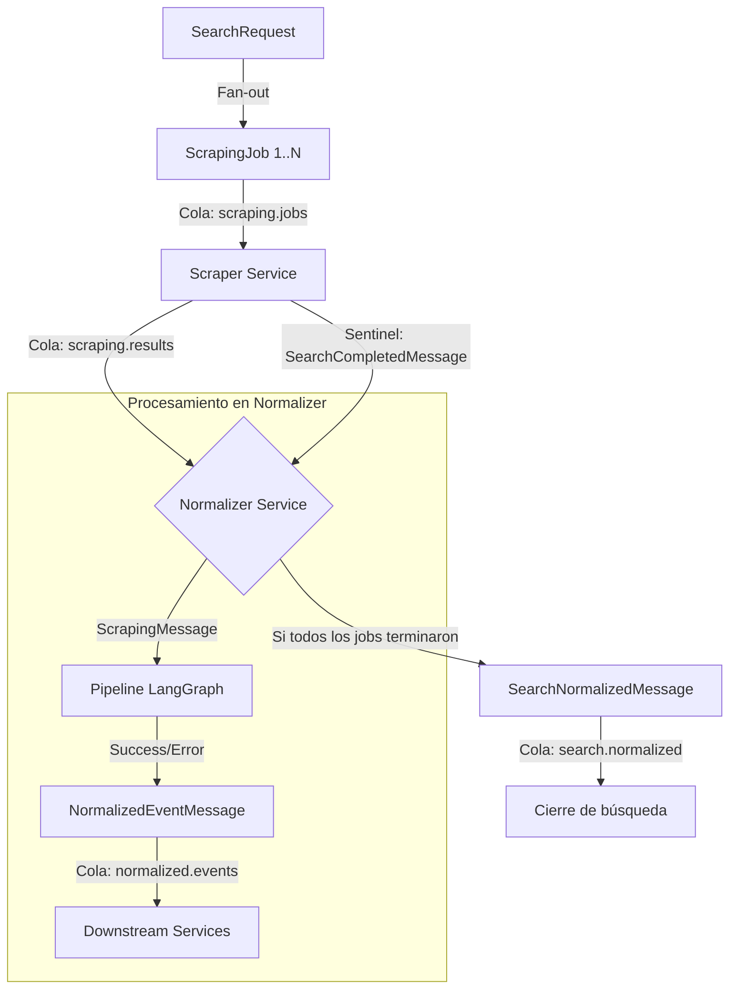

# Documentación de Eventos, Colas y Mensajería

Esta documentación detalla el flujo de comunicación asíncrona entre los microservicios de **PriceTracker**, utilizando **RabbitMQ** como bus de mensajes.

---

## 1. Arquitectura de Mensajería

El sistema utiliza un modelo de **Job Queue** y **Event-Driven Architecture**. RabbitMQ gestiona la durabilidad de los mensajes y la distribución de carga entre múltiples instancias de consumidores (Competing Consumers).

### Conceptos Clave
- **Exchange:** Se utiliza el *default exchange* (direct) donde la `routing_key` coincide con el nombre de la `queue`.
- **DLQ (Dead Letter Queue):** Cada cola principal tiene una cola de "letras muertas" asociada. Si un mensaje falla tras 3 reintentos (configurables en `MAX_RETRIES`), se mueve automáticamente a la DLQ para inspección manual.
- **Retry Strategy:** Backoff exponencial (min(2^n, 30) segundos) gestionado por el `BaseConsumer` en `shared/messaging.py`.

---

## 2. Definición de Colas

| Cola | Propósito | Productor | Consumidor |
| :--- | :--- | :--- | :--- |
| `scraping.jobs` | Recibe solicitudes de scraping para una URL específica. | API / Scheduler | Scraper Service |
| `scraping.results` | Transporta los resultados crudos del scraper y mensajes de control (sentinels). | Scraper Service | Normalizer Service |
| `normalized.events` | Notifica que un producto individual ha sido procesado (éxito o fallo). | Normalizer Service | Downstream (Alerts, UI, etc.) |
| `search.normalized` | Notifica que una búsqueda completa (que pudo generar N jobs) ha finalizado. | Normalizer Service | Downstream (Search API) |

> **Nota:** Todas las colas tienen su contraparte `.dlq` (ej. `scraping.jobs.dlq`).

---

## 3. Flujo de Eventos



1.  **Inicio:** Una solicitud de búsqueda se divide en $N$ tareas de scraping.
2.  **Scraping:** El `Scraper Service` procesa cada URL y envía un `ScrapingMessage` a `scraping.results`.
3.  **Control:** Tras enviar todos los jobs de una búsqueda, el Scraper envía un `SearchCompletedMessage` (sentinel) para indicar cuántos resultados esperar.
4.  **Normalización:** El `Normalizer Service` procesa cada resultado individual, guarda en la base de datos y emite un `NormalizedEventMessage`.
5.  **Cierre:** Cuando el recuento de jobs procesados coincide con el valor esperado del sentinel, se emite un `SearchNormalizedMessage`.

---

## 4. Modelos de Datos (Contratos)

Todos los modelos están definidos en `backend/shared/model.py` utilizando Pydantic.

### ScrapingMessage
Enviado por el Scraper al finalizar un job individual.
- `job_id`: UUID único del job.
- `search_id`: ID de la búsqueda padre (opcional).
- `product_ref`: Referencia interna del producto.
- `source_name`: Nombre de la fuente (ej. "amazon").
- `raw_fields`: Diccionario con datos crudos extraídos (título, precio crudo, etc.).
- `state`: Estado actual (`scraped` o `failed`).

### SearchCompletedMessage (Sentinel)
Enviado por el Scraper para coordinar el fin de una búsqueda masiva.
- `search_id`: ID de la búsqueda.
- `total_jobs`: Cuántos mensajes individuales de scraping se generaron para este ID.

### NormalizedEventMessage
Notificación de que un producto ya tiene formato canónico.
- `normalized_product`: Objeto `NormalizedProduct` con campos estandarizados:
    - `canonical_name`: Nombre limpio del producto.
    - `price`: Valor numérico final.
    - `currency`: Código ISO (ej. "COP").
    - `confidence`: Nivel de confianza de la normalización ("high", "medium", "low").
- `state`: `normalized` o `normalization_failed`.

---

## 5. Cómo usar la mensajería

### Para enviar un mensaje (Publisher)
Usa las clases derivadas de `BasePublisher`.
```python
# Ejemplo en Scraper
publisher = ScrapingResultPublisher(rmq_connection)
await publisher.publish_result(raw_result)
```

### Para procesar una cola (Consumer)
Hereda de `BaseConsumer` e implementa el método `handle`.
```python
class MyConsumer(BaseConsumer):
    async def handle(self, payload: dict):
        # La lógica de negocio va aquí
        data = MyModel.model_validate(payload)
        ...
```
El `BaseConsumer` se encarga de:
- Conexión robusta.
- Deserialización JSON.
- **ACK automático** si `handle` termina sin excepciones.
- **Reintentos y DLQ** si `handle` falla.
